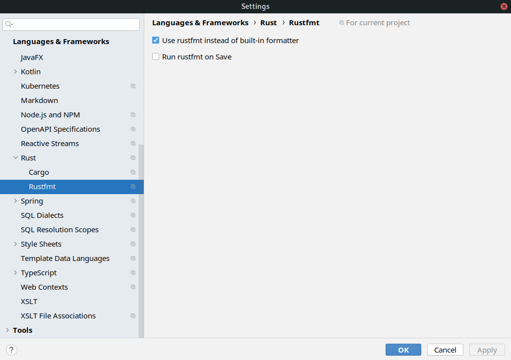
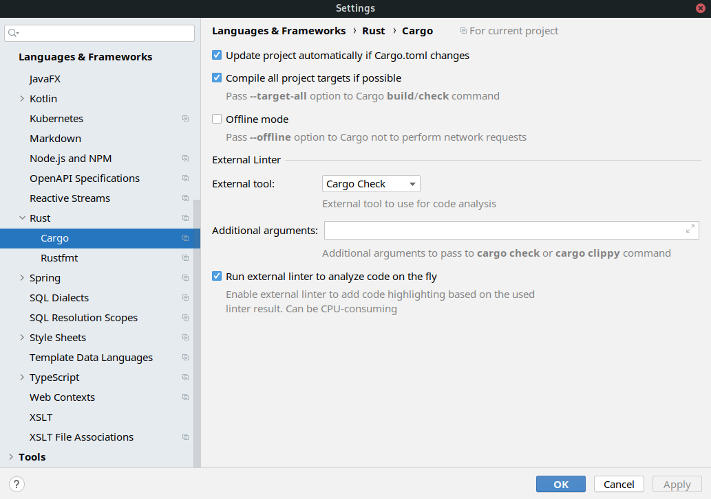

# Contributing to H2O Kubernetes

H2O Kubernetes tools are primarily developed by [H2O.ai](https://h2o.ai). Any contributions are welcome.

The language of choise is [Rust](https://www.rust-lang.org/), using its standard built-in tools. The build and dependency management tool is therefore [Cargo](https://crates.io/).
There are three projects in the workspace defined by the top-level [Cargo.toml](Cargo.toml):

1. `cli`,
1. `deployment`,
1. `operator`.

Two binaries (`cli`, `operator`) and one library (`deployment`) with common code for both binaries.

## Building, testing and running

- Development build (whole workspace) : `cargo build`
- Release build (whole workspace): `cargo build --release`
- Development run: `cargo run -p <binary-name> -- <binary-specific-args>`, where `<binary-name>` is either `h2ok` for the CLI or `h2o-operator` for the operator.
- Test (whole workspace): `cargo test` - please note many tests have prerequisites - running Kubernetes cluster and the `KUBECONFIG` variable set.

One of the ways to set-up a Kubernetes cluster locally [K3s.io](https://k3s.io/) - `curl -sfL https://get.k3s.io | sh -`. There are also [Docker images](https://hub.docker.com/r/rancher/k3s/tags)
available for K3S. For K3S on Linux `export KUBECONFIG=/etc/rancher/k3s/k3s.yaml` points to the kubeconfig created during K3S installation and is
sufficient for all tests and running the binaries as well.

Running each command only for a certain project from the workspace is as simple as adding the `-p <project-name>` argument.
The project name is defined in each project's `Cargo.toml`. Any Kubernetes cluster with support for all resources required by H2O
 can be used. It is necessary to expose the `KUBECONFIG` environment variable.

## Automated tests
Automated tests are ran via GitHub actions - the test environment provides the `KUBECONFIG` environment variable with path to a [K3S](https://k3s.io/) Kubernetes instance.
The definition is to be found in the [.github/workflows/rust.yml](.github/workflows/rust.yml) file.

## Releasing
Currently, only the `h2ok` CLI has automated release to be found in the [.github/workflows/release.yml](.github/workflows/release.yml) file. To release,
tag a commit with version on `master` branch and push the tag into GitHub. The release will be triggered automatically.

```bash
git tag "0.1.0:
git push
```

The release compiles `h2ok` for various targets - Linux, Mac and Windows.

## IDEs

No specific IDE is required to develop `h2o-kubernetes`, as only standardized, vendor-neutral tools like `cargo` or `rustfmt` are used.
Visit the [AreWeIdeYet.com](https://areweideyet.com/) for up-to-date information on available editors and IDEs. 
IDEs by [JetBrains*](https://intellij-rust.github.io/) (IDEA, CLion etc.) provide an excellent Rust support with the [Rust plugin](https://intellij-rust.github.io/).
This applies to the community edition of IntelliJ IDEA as well.

### JetBrains Rust Plugin (IntelliJ IDEA)

As [rustfmt](https://github.com/rust-lang/rustfmt) is used to format the code, make sure to enable it instead of
the built-in formatter in the Rust plugin's settings.



To enable on-the-fly linting, enable the external linter to run on background.



*Screenshots taken from IntelliJ IDEA 2020.2*