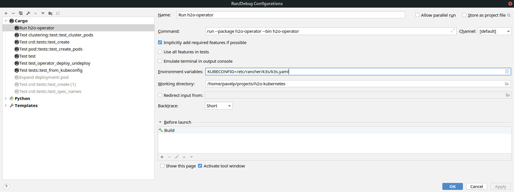

# Tests

## Automated tests

Automated tests are ran for all workspace projects at once using GitHub Actions. Tests are defined in
[rust.yml](../../../.github/workflows/rust.yml) configuration file. With each workspace project's tests running on Kubernetes cluster using
its own service account, the `operator` project defines its required permissions in [cluster_role.yaml](../../tests/permissions/cluster_role.yaml).
This file is placed in the tests folder to indicate it is used during testing, yet the very same file is bundled with each release.
This is to aid Kubernetes cluster administrators with permission creation. See [release documentation](../release/README.md) for more details.
Once the cluster role is created, a [service account](https://kubernetes.io/docs/tasks/configure-pod-container/configure-service-account/) 
and a [role binding](https://kubernetes.io/docs/reference/access-authn-authz/rbac/) are generated using a [custom shell script](../../../tests_common/k8s_cluster_setup/kubeconfig.sh).
This shell script also creates a new kubeconfig in the `{project-root}/kubeconfigs-generated/` folder (igored by GIT). This kubeconfig
is used before operator tests are invoked to make sure only the required set of permissions is used. Permission control testing allows to:

1. Check all permissions required are listed and well documented for the user,
1. If a new permissions requirement is introduced unintentionally, tests will fail,
1. Make sure the underlying Kubernetes cluster tests run on top of may be swapped, regardless of default Kubeconfig's role permissions.

Automated tests run in on-demand created Kubernetes cluster - [K3S](https://k3s.io/). This is a lightweight Kubernetes 
distribution. Each test create such an instance locally for itself and test against that. Once done, the cluster is simply terminated with
the rest of the test environment. Currently, only the latest version is used. This ensures early warnings about usages
of deprecated resources.

As H2O operator is certified for Red Hat OpenShift, there are two flavors of H2O `CustomResourceDefinition`:

1. `v1` - for general distribution,
1. `v1beta1` - to be used for OpenShift, as OpenShift does not yet support CRD `v1`.

Both definitions contain the very same H2O Custom Resource Definition, only the version of the YAML structure definition differs. 
Both contain the same H2O custom resource version. The `v1beta1` support is to be terminated once OpenShift starts supporting `v1`.
Until then, both `v1` and `v1beta1` definitions are tested.

Exactly the same test battery is ran as a part of [operator release](../release/README.md). 

## Running tests

The full test suite may be run manually/locally with one prerequisite - a running **Kubernetes cluster**. To invoke tests,
simply run `cargo test -p operator`. Tests requiring Kubernetes will check availability of `kubeconfig` using `kubeconfig_location_panic`
from [tets_common](../../../tests_common/src/lib.rs) module. This function implies there is a `KUBECONFIG` environment variable
present and set to a valid location, reachable by the operator. If the `kubeconfig` is not set in a proper way or the cluster is not functional,
the tests will [panic](https://doc.rust-lang.org/std/macro.panic.html).

### CRD deployment
Make sure to create H2O `CustomResourceDefinition` into the cluster, otherwise the operator. Unless necessary,
use the [latest](../../crd/h2os.h2o.ai.crd.yaml) generally distributed CRD. Invoking `kubectl apply -f h2os.h2o.ai.crd.yaml` is sufficient.
To create a CRD, one must have sufficient permissions to do so.

### Permissions
Always make sure the operator is running under an account with enough rights to perform its tasks. The
minimal required set of permissions is defined in the [cluster_role.yaml](../../tests/permissions/cluster_role.yaml) file.

### Running tests using K3S

[K3S](https://k3s.io/) is the recommended Kubernetes cluster. If K3S or any other local Kubernetes cluster can't be spawned on your platform, any third-party cluster will work
as well, e.g. [Amazon EKS](https://docs.aws.amazon.com/eks/latest/userguide/getting-started-console.html).
On MacOs, [Minikube](https://kubernetes.io/docs/tutorials/kubernetes-basics/create-cluster/cluster-intro/) is also an option.

**Step 1 - Install K3S:**
K3S offers a detailed [installation manual](To install K3S, follow the detailed) for more advanced use cases, e.g. specifying exact
K3S version.

Otherwise just use `curl -sfL https://get.k3s.io | sh -` to install latest version of K3S.

**Step 2 - Kubeconfig:**
By default, K3S creates a kubeconfig with `cluster-admin` role at `/etc/rancher/k3s/k3s.yaml`. H2O tests and the H2O operator
in general looks for the `KUBECONFIG` environment variable during launch. So do other tools, like `kubectl`. When runnings tests from console, make
sure to export the kubeconfig env var by invoking `export KUBECONFIG=/etc/rancher/k3s/k3s.yaml`.

**Step 3 - Run tests:**
Simply invoke `cargo run -p operator` from the project root to invoke tests only in the operator project. Or invoke `cargo test` in the `operator` folder for the same effect.
Please refer to [Cargo documentation](https://doc.rust-lang.org/cargo/commands/cargo-test.html) for a full list of options, including test filtering.

It is required for Rust to be [installed](https://www.rust-lang.org/tools/install) of course to run Rust tests. Use stable channel.

Tests may also be ran using IntelliJ IDEA. Make sure to set the `KUBECONFIG` environment variable there as well. As well as in
any other IDE used.

